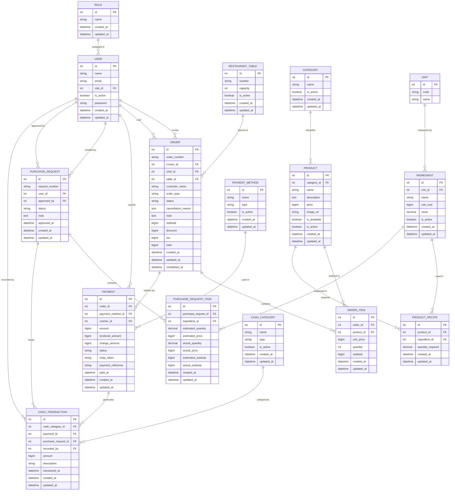

```mermaid
erDiagram
    ROLE ||--o{ USER : "assigned to"
    USER ||--o{ ORDER : "runner"
    USER ||--o{ ORDER : "chef"
    USER ||--o{ PAYMENT : "cashier"
    USER ||--o{ PURCHASE_REQUEST : "created by"
    USER ||--o{ PURCHASE_REQUEST : "approved by"
    USER ||--o{ CASH_TRANSACTION : "recorded by"

    RESTAURANT_TABLE ||--o{ ORDER : "placed at"
    ORDER ||--o{ ORDER_ITEM : "contains"
    ORDER ||--o{ PAYMENT : "settled via"
    
    PRODUCT ||--o{ ORDER_ITEM : "ordered in"
    CATEGORY ||--o{ PRODUCT : "classifies"
    
    PRODUCT ||--o{ PRODUCT_RECIPE : "requires"
    INGREDIENT ||--o{ PRODUCT_RECIPE : "used in"
    UNIT ||--o{ INGREDIENT : "measured by"

    PURCHASE_REQUEST ||--o{ PURCHASE_REQUEST_ITEM : "contains"
    INGREDIENT ||--o{ PURCHASE_REQUEST_ITEM : "requested in"

    CASH_CATEGORY ||--o{ CASH_TRANSACTION : "categorizes"
    PAYMENT_METHOD ||--o{ PAYMENT : "used in"
    PAYMENT ||--o{ CASH_TRANSACTION : "generates"
    PURCHASE_REQUEST ||--o{ CASH_TRANSACTION : "funds"

    USER {
        int id PK
        string name
        string email
        int role_id FK
        boolean is_active
        string password
        datetime created_at
        datetime updated_at
    }

    ROLE {
        int id PK
        string name
        datetime created_at
        datetime updated_at
    }

    ORDER {
        int id PK
        string order_number
        int runner_id FK
        int chef_id FK
        int table_id FK
        string customer_name
        string order_type
        string status
        text cancellation_reason
        text note
        bigint subtotal
        bigint discount
        bigint tax
        bigint total
        datetime created_at
        datetime updated_at
        datetime completed_at
    }

    ORDER_ITEM {
        int id PK
        int order_id FK
        int product_id FK
        bigint unit_price
        int quantity
        bigint subtotal
        datetime created_at
        datetime updated_at
    }

    PRODUCT {
        int id PK
        int category_id FK
        string name
        text description
        bigint price
        string image_url
        boolean is_available
        boolean is_active
        datetime created_at
        datetime updated_at
    }

    CATEGORY {
        int id PK
        string name
        boolean is_active
        datetime created_at
        datetime updated_at
    }

    INGREDIENT {
        int id PK
        int unit_id FK
        string name
        bigint unit_cost
        decimal stock
        boolean is_active
        datetime created_at
        datetime updated_at
    }

    UNIT {
        int id PK
        string code
        string name
    }

    RESTAURANT_TABLE {
        int id PK
        string number
        int capacity
        boolean is_active
        datetime created_at
        datetime updated_at
    }

    PURCHASE_REQUEST {
        int id PK
        string request_number
        int user_id FK
        int approved_by FK
        string status
        text note
        datetime approved_at
        datetime created_at
        datetime updated_at
    }

    PURCHASE_REQUEST_ITEM {
        int id PK
        int purchase_request_id FK
        int ingredient_id FK
        decimal estimated_quantity
        bigint estimated_price
        decimal actual_quantity
        bigint actual_price
        bigint estimated_subtotal
        bigint actual_subtotal
        datetime created_at
        datetime updated_at
    }

    CASH_CATEGORY {
        int id PK
        string name
        string type
        boolean is_active
        datetime created_at
        datetime updated_at
    }

    CASH_TRANSACTION {
        int id PK
        int cash_category_id FK
        int payment_id FK
        int purchase_request_id FK
        int recorded_by FK
        bigint amount
        string description
        datetime transacted_at
        datetime created_at
        datetime updated_at
    }

    PAYMENT_METHOD {
        int id PK
        string name
        string type
        boolean is_active
        datetime created_at
        datetime updated_at
    }

    PAYMENT {
        int id PK
        int order_id FK
        int payment_method_id FK
        int cashier_id FK
        bigint amount
        bigint tendered_amount
        bigint change_amount
        string status
        string snap_token
        string payment_reference
        datetime paid_at
        datetime created_at
        datetime updated_at
    }

    PRODUCT_RECIPE {
        int id PK
        int product_id FK
        int ingredient_id FK
        decimal quantity_required
        datetime created_at
        datetime updated_at
    }
```
